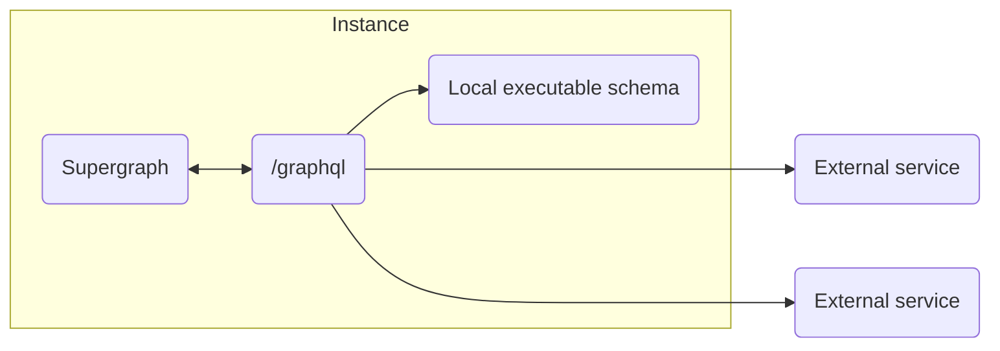

[](https://www.npmjs.com/package/mesh-local-federation)
[](https://codecov.io/gh/stackables/mesh-local-federation)

# GraphQL mesh gateway with local federation

Disclaimer: This is 99% glue around the the following excellent packages:

- [@graphql-mesh/\*](https://the-guild.dev/graphql/mesh/docs)
- [@theguild/federation-composition](https://github.com/the-guild-org/federation)

But for a specific workflow is sets up things in s simple manner tht is just nice and clean to use.

## Workflow



#### Define external services

```typescript
const subgraphs = [
	{
		name: "users",
		url: "https://federated.users.service.endpoint/graphql",
	},
	{
		name: "orders",
		url: "https://federated.orders.service.endpoint/graphql",
	},
	// ...
];
```

#### Create local executable schema

```typescript
import { buildSubgraphSchema } from "@graphql-tools/federation";

export const localSchema = buildSubgraphSchema({
	typeDefs: /* GraphQL */ `
		type Query {
			hello: String
		}
	`,
	resolvers: {
		Query: {
			hello: () => {
				return "world";
			},
		},
	},
});
```

#### Combine them into a single local yoga instance

```typescript
const { yogaConfig, supergraphSDL } = createGatewayConfig({
	subgraphs,
	localSchema,
});
```

## Customize headers

Special hook is called before each outgoing remote request. Local schema request will have the `context` filled with the original `yoga context`.

```typescript
const { yogaConfig, supergraphSDL } = createGatewayConfig({
	onRemoteRequestHeaders: async ({ url, context }) => {
		return {
			Authorization: `Bearer ${await getToken(url)}`,
		};
	},
});
```

## Using a predefined supergraph file (much faster)

```typescript
const { yogaConfig } = createGatewayConfig({
	subgraphs,
	localSchema,
	supergraphSDL, // <--- Pass in a precalculated supergraph schema
});
```

For example to following code snipped users [materialize-ts-function](https://www.npmjs.com/package/materialize-ts-function) to save the supergraphql during build step.

```typescript
/**
 * @materialize
 */
async function materializedSupergraphSDL() {
	const { supergraphSDL } = createGatewayConfig({
		subgraphs,
		localSchema,
	});

	return {
		subgraphs,
		supergraphSDL,
	};
}

async function main() {
	// get cached supergraphSDL
	const { subgraphs, supergraphSDL } = await materializedSupergraphSDL();

	// use prebuilt supergraphSDL
	const { yogaConfig } = createFederatedGateway({
		subgraphs,
		localSchema,
		supergraphSDL,
	});
}
```

`npx materialize-ts-function` during build step will run the supergraph generation once and bundle the resulting definition in the source code
