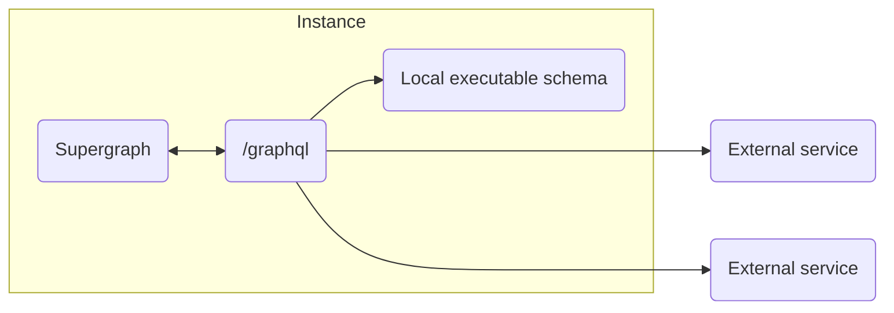

[](https://www.npmjs.com/package/mesh-local-federation)
[](https://codecov.io/gh/stackables/mesh-local-federation)

# GraphQL mesh gateway with local federation

Disclaimer: This is 99% glue around the the following excellent packages:

- [@graphql-mesh/\*](https://the-guild.dev/graphql/mesh/docs)
- [@theguild/federation-composition](https://github.com/the-guild-org/federation)

But for a specific workflow is sets up things in s simple manner tht is just nice and clean to use.

## Workflow



#### Define external services

```typescript
import type { SubgraphService } from "mesh-local-federation";

const subgraphs: SubgraphService[] = [
	{
		name: "users",
		url: "https://federated.users.service.endpoint/graphql",
	},
	{
		name: "orders",
		url: "https://federated.orders.service.endpoint/graphql",
	},
	// ...
];
```

#### Create local executable schema

```typescript
import { buildSubgraphSchema } from "@graphql-tools/federation";

export const localSchema = buildSubgraphSchema({
	typeDefs: /* GraphQL */ `
		type Query {
			hello: String
		}
	`,
	resolvers: {
		Query: {
			hello: () => {
				return "world";
			},
		},
	},
});
```

#### Build supergraph definition

```typescript
import { createSupergraph } from "mesh-local-federation";

const supergraphSDL = await createSupergraph({
	subgraphs,
	localSchema,
	onRemoteRequestHeaders: ({ url }) => {
		return {
			Authorization: `Bearer ${await getToken(url)}`,
		};
	},
});
```

Result of this step can be cached and the resulting schema definition can be used for the next steps to speed up the precess significantly.

[materialize-ts-function](https://www.npmjs.com/package/materialize-ts-function) is a simple way to do this during build process.

#### Create server

```typescript
import { createServer } from "node:http";
import { createMeshInstance } from "mesh-local-federation";
import { createYoga } from "graphql-yoga";

const config = await createMeshInstance({
	supergraphSDL,
	localSchema: harness.localSchema,
	onRemoteRequestHeaders: ({ url }) => {
		return {
			Authorization: `Bearer ${await getToken(url)}`,
		};
	},
});

const yoga = createYoga({
	...config,
	context: ({ request }) => {
		// context will be available in onRemoteRequestHeaders
		// and will be passed to local graph
	},
});

const server = createServer(yoga);

server.listen(4000, () => {
	console.info("Server is running on http://localhost:4000/graphql");
});
```
